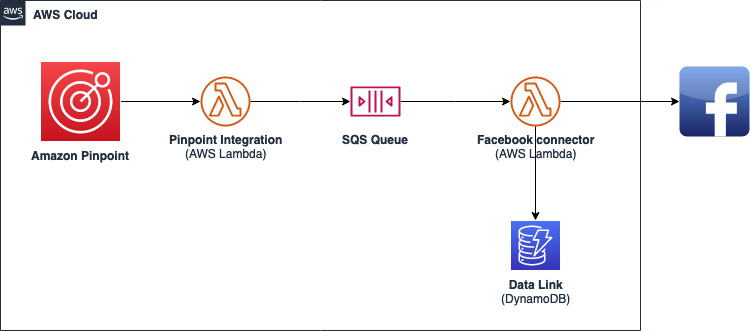

# Amazon Pinpoint Facebook Channel

The purpose of this application is to be used in integration with Amazon Pinpoint Campaigns and Journeys to add users to a Facebook Audience for Targeting purposes.

## Introduction

This sample include code that helps to run campaigns in Facebook by leveraging the Amazon Pinpoint campaigns. The code creates automatically the Facebook objects that are needed to run the campaign on the target audience imported by Amazon Pinpoint.

The Facebook objects (campaign, ad, adset and ad creative), are created as draft and can be finalised by an operator in order to update the key information and finally run the campaign.

The audience is imported by using EMAIL address as key information and, optionally, can incorporate additional fields (eg. phone number or mobile advertiser ID) to improve the targeting capability of the Facebook audience. Additionally, the sample can be extended to use more custom attributes from the endpoint to leverage demographic details of the users (eg. gender, country, date of birth or any other field supported by the [custom audiences](https://developers.facebook.com/docs/marketing-api/audiences/guides/custom-audiences/) on Facebook)

## Architecture



The sample deploy the architecture as highlighed in the diagram above. The SQS queue is required by the application to keep the sequence on which the users are imported inside the Facebook custom audience (as Facebook require a `sequenceId` on their API).

The DynamoDB table contains the application details needed by subsequent Lambda invocations (eg. the audience Id or campaign Id created during the first import)

## Getting started

To get started and deploy the code in your AWS account please follow the current guides:

### Deployment

1. **Install** the dependencies:

   > ```sh
   > yarn install
   > cd infra
   > yarn install
   > ```

2. **Build** the code and the assets

   > `yarn build:all`

3. **Configure** an AWS Profile on your development machine to deploy this project (e.g.: `my-deployment-profile`)
4. **Define** application configuration by navigating to `infra/config`
   - Copy the default.yaml file to a new file eg. `local-XXXXXXXXXXXX.yaml` where `XXXXXXXXXXXX` is your AWS ACCOUNT ID
   - Replace the config settings to your own values. Mandatory changes to `account` and `facebook` configuration section
5. **Bootstrap** your CDK environment (if you haven't done it already)

   > `cd infra`
   >
   > `yarn bootstrap --profile my-deployment-profile`
   >
   > where `my-deployment-profile` is the profile you've created on step 3
   > You are required to have the right access to your AWS account to perform this action

6. **Deploy** the infra code in your AWS Account

   > `cd infra`
   >
   > In case _you aren't in this folder already_

   > `yarn dev:deploy:all --profile my-deployment-profile`
   >
   > where `my-deployment-profile` is the profile you've created on step 3
   > You are required to have the right access to your AWS account to perform this action.

### Custom Channel Usage

Now that the custom AWS Lambdas have been deployed you can configure your Amazon Pinpoint campaign to use the custom channel. Navigate to the [Amazon Pinpoint custom channel](./docs/pinpoint-custom-channel.md) documentation for a step-by-step guide on how to use it.

## Requirements

The application is developed using [AWS Cloud Development Kit](https://aws.amazon.com/cdk/) and needs the following pre-requirements:

- Nodejs v16 or above (tested with `v16.15.0`)
- yarn v1.22 or above (tested with `1.22.18`)
- vscode as editor (optional)

In order to deploy it is also required to have:

- AWS Account Access ([setup](https://aws.amazon.com/premiumsupport/knowledge-center/create-and-activate-aws-account/)) with enough permission to deploy the application
- [AWS CLI version 2](https://docs.aws.amazon.com/cli/latest/userguide/getting-started-install.html) with [named profile setup](https://docs.aws.amazon.com/cli/latest/userguide/cli-configure-profiles.html)

## Security

See [CONTRIBUTING](CONTRIBUTING.md#security-issue-notifications) for more information.

## License

This library is licensed under the MIT-0 License. See the LICENSE file.

