# Amazon Pinpoint Custom channel

This step by step guide show how you can create a new Amazon Pinpoint project and utilise the custom channel that this samples has deployed in the account

1. Create an Amazon Pinpoint project. From Amazon Pinpoint -> All Projects
   > 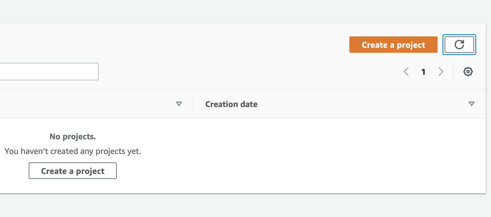
2. Click on `Create a project` and provide a name. eg `test-new-project`
   > 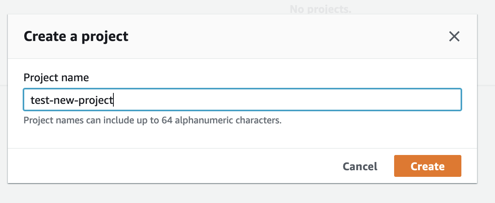
3. Configure the `email` channel.
   > **Note**: this is needed so the option `"email"` is available when you filter segments
   > 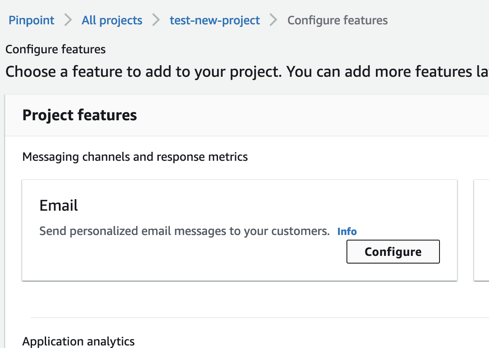
4. Define the email address, click on verfiy and then save.
   > **Note**: this is needed only for the [sandbox mode](https://docs.aws.amazon.com/pinpoint/latest/userguide/channels-email-setup-production-access.html), if you're not in sandbox mode this step should be optional
   > 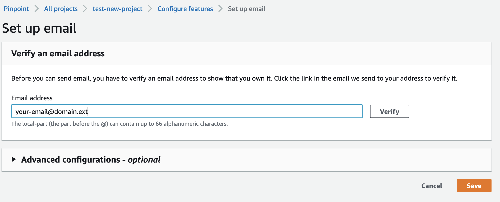
5. Navigate to the segment list and create a new segment.
   > 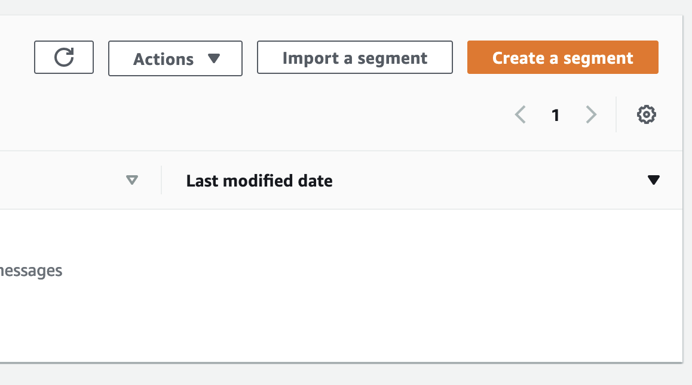
6. Click on _Import a segment_ and upload it from your local machine and then click the `Create segment` button
   > **Note**L you can use [this file](../sample/pinpoin_test_segment.json) as sample but remember to change the mock email-addresses and other data
   > 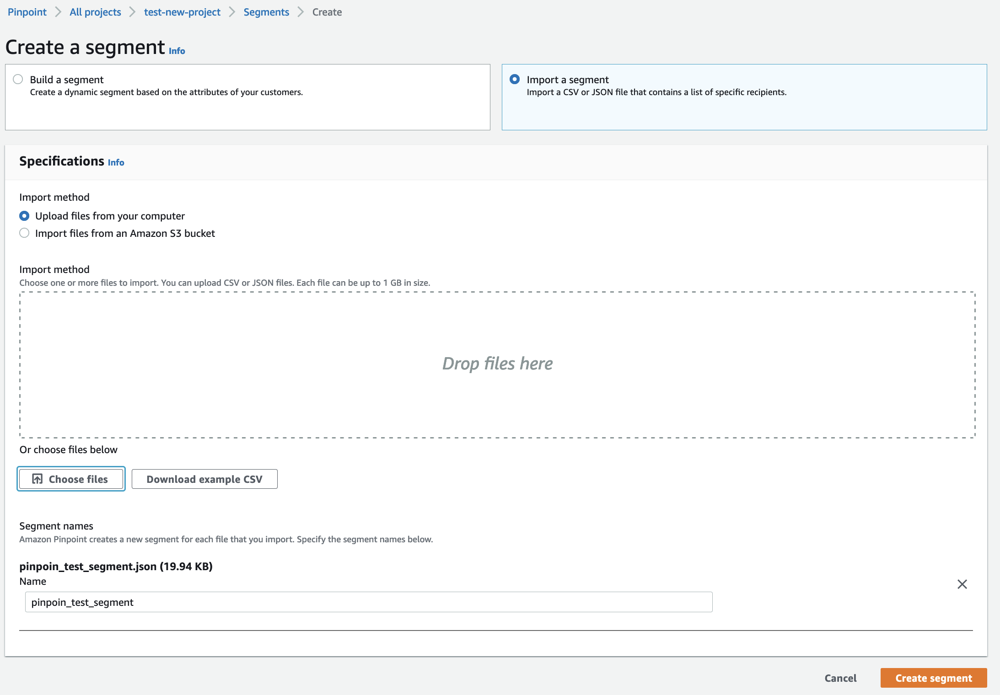
7. Navigate to the segment list and create a dynamic segment, then filter the imported one with the following filters
   > 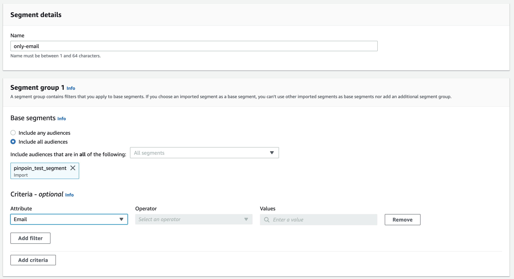
8. Navigate to the campaigns and create a new campaign
   > 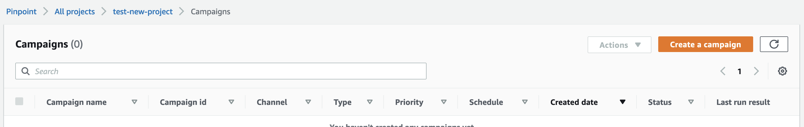
9. Define the custom channel as channel type
   > 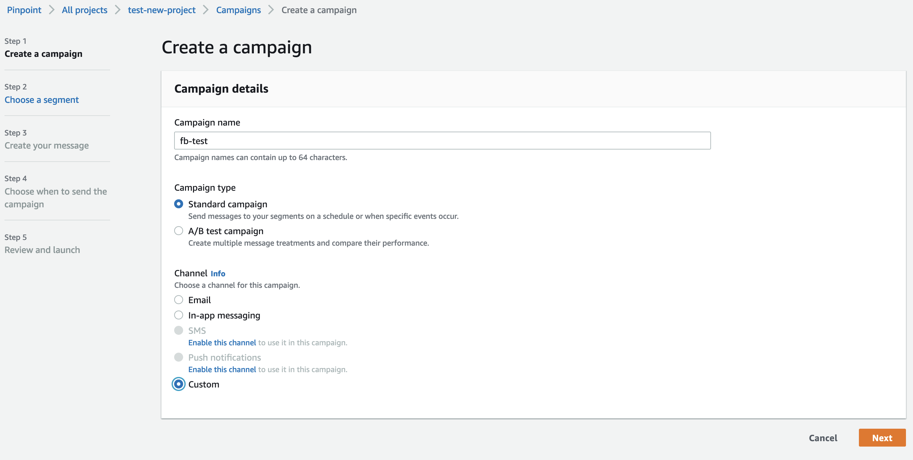
10. Use an existing segment and select `only-email` (as the one created on step 7)
    > 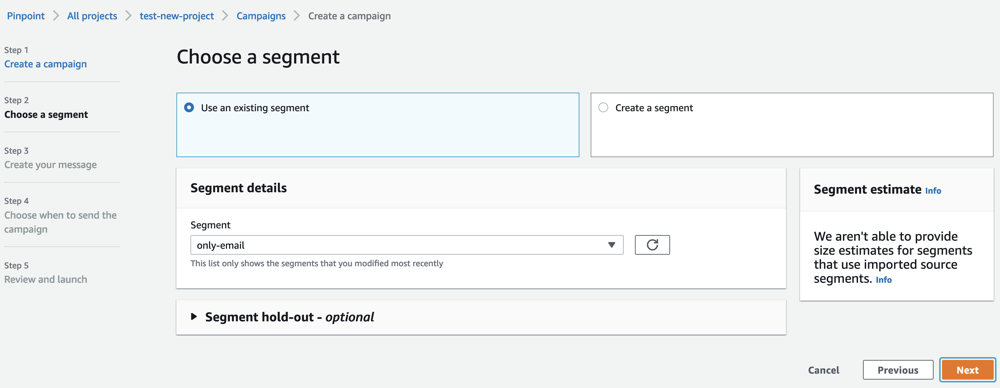
11. Now select the AWS Lambda function deployed by this sample (`pinpoint-faceboook-integration`) and select email as endpoint option
    > 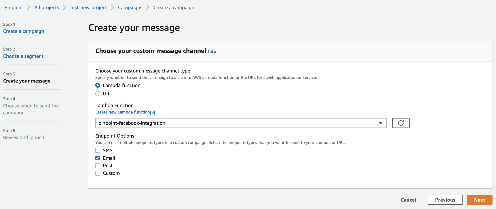
12. Go to the rest of the wizard and review and launch the campaign.

Now that all the steps are completed you should be able to see the objects in Facebook with a specific naming convention. The sample creates Facebook audience, Facebook Campaigns, Ads, Ad Set and Ad Creative.

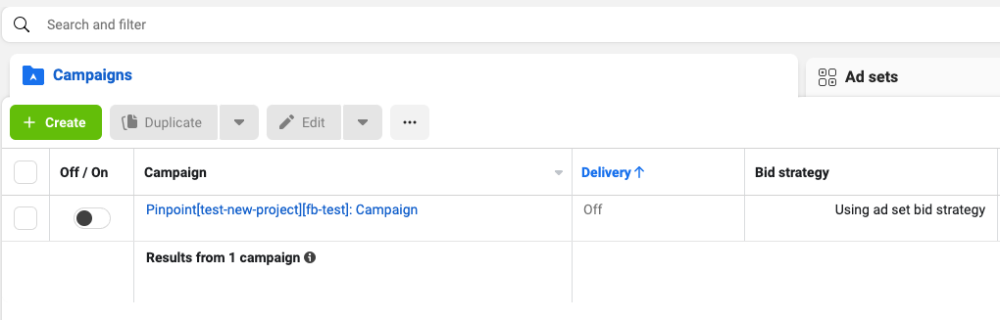
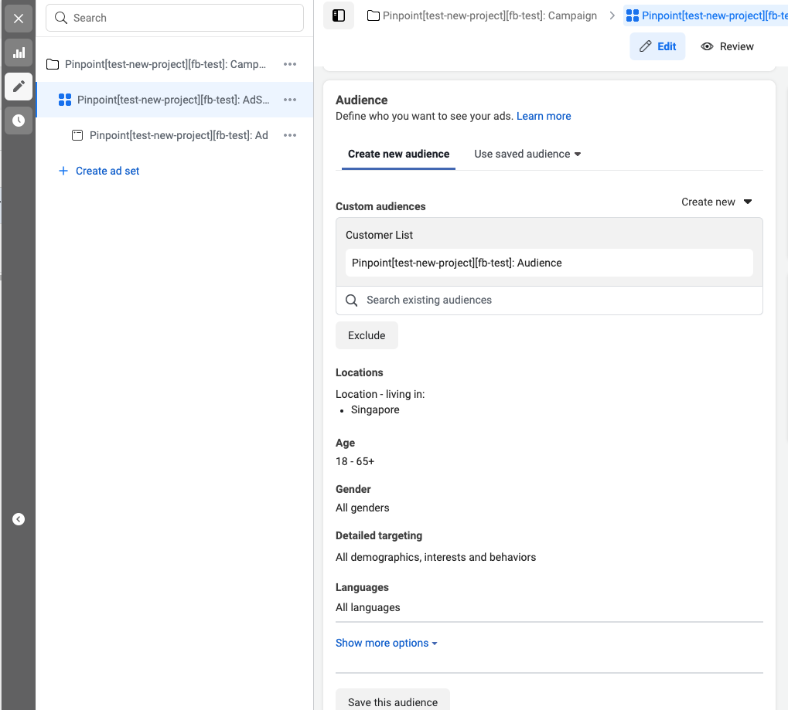
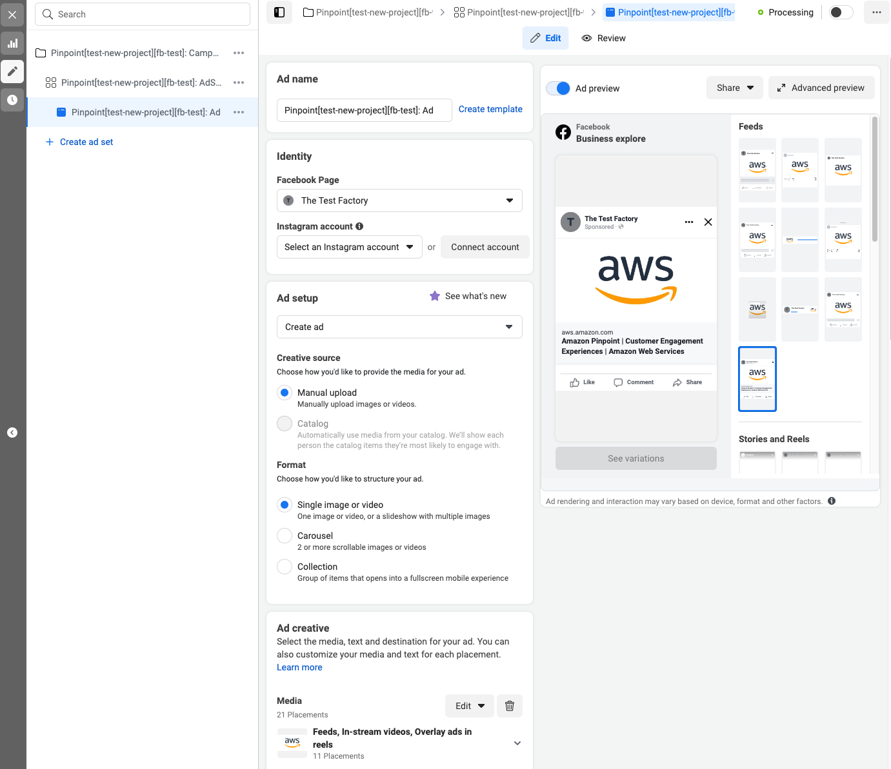
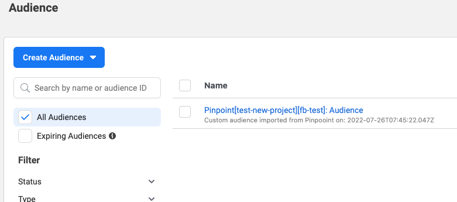
